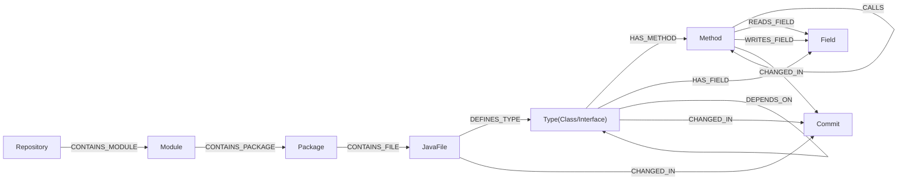
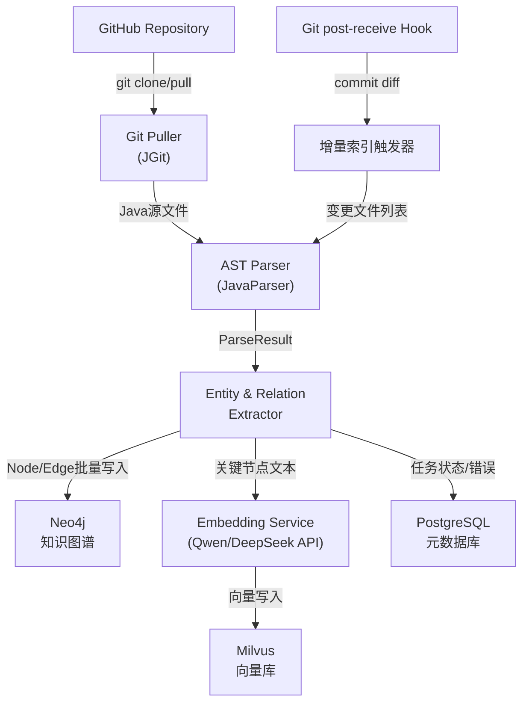

# 代码变更知识图谱 — 数据建模与离线索引设计

## 技术栈选型

- **图数据库**: Neo4j Community Edition — Java Driver 原生支持，Cypher 查询表达力强，最适合多跳关系遍历
- **关系型元数据库**: PostgreSQL — 存储任务记录、提交日志、解析错误
- **向量数据库**: Milvus (Standalone) — 代码语义嵌入，供 LLM 做语义检索
- **AST 解析器**: JavaParser — 纯 Java，支持 Java 8-21，可提取类/方法/字段/调用链
- **RPC 框架**: gRPC — Protobuf 契约明确，下游 LLM 服务可能是 Python，语言无关性更强
- **HTTP**: Spring Boot MVC
- **嵌入 API**: Qwen / DeepSeek Embedding API（text-embedding 接口）

---

## 一、数据建模 — Neo4j 节点设计

### 节点标签 (Node Labels)

**Repository**
- `id`, `name`, `url`, `defaultBranch`, `updatedAt`

**Module** (Maven 子模块)
- `id`, `name`, `path`, `groupId`, `artifactId`

**Package**
- `id`, `qualifiedName`（如 `com.example.service`）, `path`

**JavaFile**
- `id`, `path`, `relativePath`, `checksum`（MD5，用于变更检测）, `lineCount`, `lastModified`

**Type** (类/接口/枚举/注解，统一标签，用 `kind` 区分)
- `id`, `qualifiedName`, `simpleName`, `kind`（CLASS/INTERFACE/ENUM/ANNOTATION）
- `accessModifier`, `isAbstract`, `isFinal`, `isStatic`
- `filePath`, `lineStart`, `lineEnd`

**Method**
- `id`, `qualifiedName`（`com.example.Foo#doSomething(String,int)`）
- `simpleName`, `signature`, `returnType`
- `accessModifier`, `isStatic`, `isAbstract`, `isConstructor`
- `filePath`, `lineStart`, `lineEnd`

**Field**
- `id`, `qualifiedName`, `simpleName`, `typeName`
- `accessModifier`, `isStatic`, `isFinal`, `filePath`, `lineNo`

**Commit**
- `hash`, `message`, `author`, `email`, `timestamp`, `branch`

---

## 二、数据建模 — Neo4j 关系设计

### 结构关系（描述代码组织层级）

```
(Repository)  -[:CONTAINS_MODULE]->  (Module)
(Module)      -[:CONTAINS_PACKAGE]-> (Package)
(Package)     -[:CONTAINS_SUB]->     (Package)
(Package)     -[:CONTAINS_FILE]->    (JavaFile)
(JavaFile)    -[:DEFINES_TYPE]->     (Type)
(Type)        -[:HAS_METHOD]->       (Method)
(Type)        -[:HAS_FIELD]->        (Field)
(Type)        -[:INNER_CLASS_OF]->   (Type)
```

### 继承/实现关系（影响面传播的核心路径）

```
(Type)  -[:EXTENDS]->     (Type)      // 类继承
(Type)  -[:IMPLEMENTS]->  (Type)      // 接口实现
```

### 调用/依赖关系（最重要，影响面分析的主要跳转依据）

```
(Method)  -[:CALLS {lineNo}]->       (Method)   // 方法调用
(Method)  -[:READS_FIELD]->          (Field)    // 读字段
(Method)  -[:WRITES_FIELD]->         (Field)    // 写字段
(Type)    -[:DEPENDS_ON]->           (Type)     // 字段类型/参数类型/局部变量类型引用
(JavaFile)-[:IMPORTS]->              (Type)     // import 语句
```

### 变更追踪关系

```
(JavaFile)-[:CHANGED_IN]->(Commit)
(Type)    -[:CHANGED_IN]->(Commit)
(Method)  -[:CHANGED_IN]->(Commit)
```

### 关系三元组总览



---

## 三、Neo4j 索引设计

```cypher
CREATE CONSTRAINT ON (n:Type)     ASSERT n.qualifiedName IS UNIQUE;
CREATE CONSTRAINT ON (n:Method)   ASSERT n.id IS UNIQUE;
CREATE CONSTRAINT ON (n:Field)    ASSERT n.id IS UNIQUE;
CREATE CONSTRAINT ON (n:JavaFile) ASSERT n.path IS UNIQUE;
CREATE CONSTRAINT ON (n:Commit)   ASSERT n.hash IS UNIQUE;

CREATE INDEX ON :Type(simpleName);
CREATE INDEX ON :Method(simpleName);
CREATE INDEX ON :JavaFile(checksum);
```

---

## 四、PostgreSQL 元数据表设计

**`t_repository`** — 仓库注册信息
- `id`, `name`, `clone_url`, `branch`, `local_path`, `status`, `created_at`

**`t_index_task`** — 全量/增量索引任务
- `id`, `repo_id`, `task_type`（FULL/INCREMENTAL）, `trigger_commit`, `status`（PENDING/RUNNING/SUCCESS/FAIL）, `started_at`, `finished_at`, `error_msg`

**`t_commit_record`** — 已处理的提交记录（防重复消费）
- `id`, `repo_id`, `commit_hash`, `author`, `commit_time`, `changed_file_count`, `processed_at`

**`t_parse_error`** — 解析失败记录
- `id`, `task_id`, `file_path`, `error_type`, `error_msg`, `created_at`

---

## 五、Milvus 向量集合设计

**Collection: `code_node_embedding`**
- `node_id` (VARCHAR): Neo4j 节点 id
- `node_type` (VARCHAR): FILE / TYPE / METHOD
- `qualified_name` (VARCHAR): 供回显
- `repo_id` (VARCHAR): 过滤条件
- `embedding` (FLOAT_VECTOR, dim=1536): Qwen/DeepSeek embedding 输出

> 嵌入文本策略：Method 节点使用 `类名 + 方法签名 + Javadoc`；Type 节点使用 `类名 + 类注释 + 字段摘要`；优先取 Javadoc，无注释则拼接签名。

---

## 六、数据管道设计

### 全链路架构



### 全量索引流程

1. `IndexScheduler` 读取 `t_repository` 中注册的仓库，创建 `FULL` 类型任务
2. `GitPuller`（基于 JGit）执行 `clone` 或 `pull`，获取完整代码
3. `FileWalker` 递归扫描 `.java` 文件，计算 checksum，跳过未变化文件（幂等）
4. `JavaASTParser` 对每个文件构建 `CompilationUnit`，提取：
   - 包名 → Package 节点
   - 类/接口/枚举声明 → Type 节点
   - 字段 → Field 节点 + `HAS_FIELD` 边
   - 方法 → Method 节点 + `HAS_METHOD` 边
   - `extends`/`implements` → `EXTENDS`/`IMPLEMENTS` 边
   - `import` 语句 → `IMPORTS` 边
   - 方法体中的方法调用 → `CALLS` 边（通过 `MethodCallExpr` visitor）
   - 字段/参数类型引用 → `DEPENDS_ON` 边
5. `Neo4jBatchWriter` 使用 `UNWIND + MERGE` 批量写入，每批 500 节点
6. `EmbeddingWorker` 异步对 Type、Method 节点调用 embedding API，写入 Milvus
7. 更新 `t_index_task` 状态为 SUCCESS

### 增量索引流程（Git Hook 触发）

1. 在目标仓库的 `.git/hooks/post-receive` 中注册回调，POST 提交信息到本服务
2. 服务端接收：`commitHash`、`changedFiles`（added/modified/deleted）
3. 对 **deleted** 文件：删除 Neo4j 中该文件及其所有子节点和关联边
4. 对 **added/modified** 文件：重新执行步骤 4-6 的解析写入（MERGE 天然幂等）
5. 写入 `Commit` 节点，建立 `CHANGED_IN` 关系
6. 记录 `t_commit_record`

---

## 七、查询接口设计

### 核心影响面分析查询（Cypher 示例）

```cypher
// 给定变更的方法集合，向上找3跳内所有调用者
MATCH path = (caller:Method)-[:CALLS*1..3]->(changed:Method)
WHERE changed.id IN $changedMethodIds
RETURN DISTINCT caller, length(path) AS distance
ORDER BY distance

// 给定变更的类，找所有继承/实现它的子类
MATCH (sub:Type)-[:EXTENDS|IMPLEMENTS*1..5]->(base:Type)
WHERE base.qualifiedName IN $changedTypeNames
RETURN sub
```

### HTTP & gRPC 接口规划

**HTTP (Spring Boot MVC)**
- `POST /api/v1/impact/analyze` — 输入变更文件列表，返回影响节点集合（支持跳数参数）
- `POST /api/v1/search/semantic` — 语义检索（向量 + 图结合）
- `POST /api/v1/index/trigger` — 手动触发全量/增量索引
- `GET  /api/v1/graph/node/{id}` — 获取节点详情及一跳邻居

**gRPC (Protobuf)**
- `ImpactService.AnalyzeImpact(ImpactRequest) -> ImpactResponse`
- `SearchService.SemanticSearch(SearchRequest) -> SearchResponse`
- `IndexService.TriggerIndex(IndexRequest) -> TaskResponse`

---

## 八、Maven 多模块结构

```
ai-code-change-evaluation/            (parent pom)
├── knowledge-graph-core/             # Neo4j实体 + Repository接口 + 图操作Service
├── code-parser/                      # JavaParser封装，AST→ParseResult
├── pipeline/                         # 全量/增量索引调度、JGit集成
├── embedding-service/                # LLM Embedding API Client + Milvus写入
├── query-service/                    # 影响面分析、图查询、语义检索
└── api-gateway/                      # Spring Boot入口，暴露HTTP + gRPC接口
```

---

## 九、关键设计决策说明

- **为什么用 `qualifiedName` 而非数字 id 作为唯一键**：跨仓库/多次全量索引 `MERGE` 时，只有全限定名是稳定的业务键；数字 id 在重建时会漂移
- **为什么 `CALLS` 关系不记录所有局部变量类型**：调用链是影响面传播的主要路径，字段类型/参数类型通过 `DEPENDS_ON` 补充，两者分开存储保持边语义清晰
- **全量索引幂等性保证**：Neo4j 的 `MERGE ON MATCH SET` + 文件 checksum 双重保护，文件未变化则跳过解析
- **嵌入异步化**：调用 LLM Embedding API 是 I/O 密集型，使用线程池异步处理，不阻塞图写入主流程
