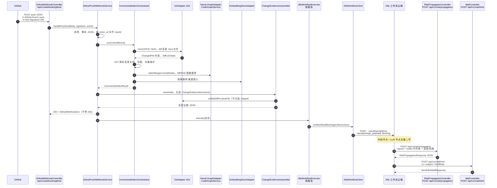

# 主体流程：GitHub Webhook → 图谱增量 → Dify → 风险传播查询 → 邮件

本文梳理本仓库中 **GitHub `push` Webhook**、**知识图谱增量更新**、**Dify 工作流编排**（提示词与代码节点脚本在 `scripts/`）、**风险传播 REST 查询**（`RiskPropagationApi`）与 **HTML 邮件发送**（`MailApi`）之间的衔接关系，并给出时序图与关键数据契约说明。

---

## 一、端到端时序图

下列时序图对应「生产形态」：**Webhook HTTP 在增量索引与变更证据组装完成后立即返回**；**Dify 以 `blocking` 模式在独立线程池中调用**，不阻塞 GitHub 的 HTTP 应答。Dify 侧在云端执行多节点工作流；其中调用本服务 `POST /api/v1/risk/propagation` 与 `POST /api/v1/mail/html` 由你在 Dify 中配置 **HTTP 请求** 或 **代码节点**（与 `scripts/post_risk_propagation.py` 等对齐）。



---

## 二、GitHub Webhook 入口与载荷要点

| 项目 | 说明 |
|------|------|
| **URL** | `POST /api/v1/webhooks/github`，`Content-Type: application/json` |
| **验签** | 请求头 `X-Hub-Signature-256`（`sha256=` + HMAC），密钥 `github.webhook.secret`；未配置则跳过（仅建议开发环境） |
| **事件过滤** | 仅当 `X-GitHub-Event` 为 `push`（忽略大小写）时执行索引与下游；否则 **204** |
| **仓库对齐** | 从 payload `repository.clone_url` 或 `repository.ssh_url` 规范化后与库内登记的活跃仓库匹配；失败 **404** |
| **分支提示** | 从 `ref` 解析 `refs/heads/{branch}`，与 `t_repository.branch` 不一致时打 **WARN** 日志（仍继续处理） |
| **幂等** | `after` 对应 commit 若已在 `t_commit_record` 标记处理，则跳过写图与 Dify，返回 `skippedDuplicate: true` |

**Java 侧实际读取的 payload 字段（节选）**

| 字段路径 | 用途 |
|----------|------|
| `before` / `after` | 父提交与新 tip；`before` 为 GitHub 全 0 SHA 时编排器改用「第一父」策略做 diff |
| `ref` | 解析分支名 |
| `repository.clone_url` / `ssh_url` | 对齐本系统 `repoId` |
| `pusher` | `CommitEvent.pusher`（对象取 `name` 或文本） |
| `commits[].message` | 汇总进变更证据 `meta.commitMessages` |
| `head_commit` / `commits[]` 中与 `after` 一致的提交 | 解析 tip 作者 `author.name` / `author.email` → `meta.authorName` / `authorEmail` |

实现参考：`evaluation-trigger/.../GithubWebhookController.java`、`GithubPushWebhookService.java`。

---

## 三、图谱增量更新（Webhook 同步路径）

`IncrementalIndexOrchestratorImpl.run(CommitEvent)` 在单次 `push` 中的核心步骤：

1. **防重复**：`commitRecordPort.isProcessed` 则短路返回（仍带 `diffOldCommit`/`diffNewCommit` 供日志）。
2. **拉代码**：`gitAdapter.cloneOrPull` + `fetch`，保证可解析 `before`/`after`。
3. **变更文件与行统计**：在 `before` 为 GitHub 空 SHA 时用 `commit^` 与「第一父 diff」；否则 `diffCommits(parent, after)`；并计算 `DiffLineStats`（总行增删）。
4. **按文件处理**  
   - **DELETED**：删 Milvus 嵌入、`graphAdapter.deleteFileNodes`。  
   - **MODIFIED**：先 `deleteFileOutgoingRelations` 再解析写入。  
   - **ADDED/MODIFIED**：`JavaAstParserService.parse` → `CodeGraphService.batchWriteParseResults` 批量 **MERGE** 到 Neo4j（类型/方法/字段/调用关系等由领域图服务统一写入）。
5. **提交节点**：`graphAdapter.batchMergeCommitNodes` 写入 `Commit` 及与变更的关联。
6. **记录**：`commitRecordPort.markProcessed`、索引任务状态 SUCCESS。

产出 **`IncrementalIndexResult`**：`changedJavaFiles`、`lineStats`、`successfulParseResults`、`diffOldCommit` / `diffNewCommit`、`commitHash` 等，供变更证据组装与 Dify 消费。

---

## 四、与 Dify 对接的字段与 HTTP 契约

### 4.1 Java → Dify 工作流触发

- **实现类**：`DifyWorkflowClient`  
- **接口**：`POST {dify.workflow.base-url}/v1/workflows/{workflow-id}/run`  
- **Body**：`response_mode: "blocking"`，`user` 来自配置，`inputs` 为单键值对：  
  - **键名**：`dify.workflow.input-key`（默认 **`change_payload`**）  
  - **值**：整包 **`ChangeEvidenceDocument` 的 JSON 字符串**（不是嵌套对象，而是 string 类型的变量，便于 Dify 工作流里再解析）

### 4.2 变更证据 JSON 结构（`ChangeEvidenceDocument`）

序列化后为 **一个 JSON 对象**（字段名与 Java Bean 一致，一般为 **camelCase**），由 `ChangeEvidenceAssembler.assemble` 在每次成功完成增量索引后构建。设计意图是：**只给 LLM 可读的结构化变更事实**（元数据、文件列表、行级统计、AST 节点锚点 + 局部 diff），**不包含** Neo4j 多跳查询结果；图谱上的影响面由后续 Dify 调用 `RiskPropagationApi` 补充。

#### 4.2.1 根对象字段总览

| 字段名 | Java 类型 | 含义概览 |
|--------|-----------|----------|
| `meta` | object | 一次推送/commit 的上下文与身份标识 |
| `changedFiles` | array | 本次 diff 涉及的 **Java 文件** 清单（含增删改类型与路径） |
| `lineStats` | object \| null | 两次提交之间 **Java 文本 diff** 汇总出的行级增删统计 |
| `nodes` | array | 本次 **成功解析** 的 AST 节点列表，每条可与图中节点对齐，并可选带 unified diff 片段 |
| `truncation` | object | 数据裁剪、预算触顶等 **告警说明**，供 LLM 降低过度推断 |

---

#### 4.2.2 `meta`（对象）

| 字段名 | 类型 | 含义 |
|--------|------|------|
| `repoId` | string | 本系统内仓库主键，与 Neo4j 中 `JavaFile.repoId`、风险传播请求体 `repoId` **一致**。 |
| `commitHash` | string | 本次索引针对的提交哈希，与增量编排结果中的 tip 一致；通常与 Webhook 的 `after` 相同。 |
| `before` | string \| null | Webhook 提供的父提交 SHA；新建分支时可能为 **40 位全 0**（编排器内部会改用第一父等策略做 diff，但此处仍保留原始 `before` 便于审计）。 |
| `after` | string | Webhook 的 `after`，即推送后的 tip。 |
| `ref` | string \| null | 原始 `refs/heads/...` 字符串，与 GitHub payload 一致。 |
| `branch` | string \| null | 从 `ref` 解析出的分支短名；若 payload 无 `ref` 则可能回退为库内登记分支。 |
| `commitMessages` | string[] | 从 Webhook `commits[].message` 收集的说明列表（**多条推送**时可能多条）；供摘要/风险评估概括「提交意图」，**不是**单条 commit 的强制一一对应。 |
| `matchedCloneUrl` | string \| null | 与 `t_repository` 对齐时使用的 **clone_url（或 ssh_url）原始字符串**，用于确认「本次事件落在哪条仓库记录上」；生产环境应在入库或网关层做好脱敏。 |
| `authorName` | string \| null | **tip 提交**作者显示名：优先 `head_commit.author.name`，否则在 `commits[]` 中找与 `after` 同 id 的条目；都无则 null。 |
| `authorEmail` | string \| null | 同上，对应 `author.email`。 |

---

#### 4.2.3 `changedFiles`（数组）

元素为 **通用 Map**，由组装器写入三个键（见 `ChangeEvidenceAssembler`）：

| 键名 | 类型 | 含义 |
|------|------|------|
| `path` | string | 文件相对于**仓库根目录**的路径（`ChangedFile.relativePath`），用于与开发者认知中的路径一致。 |
| `changeType` | string | 枚举名：`ADDED`、`MODIFIED`、`DELETED`（对应 `FileChangeType`）。**仅包含本次参与增量处理的 Java 变更文件**；与 `lineStats.javaFilesTouched` 在语义上应对齐。 |
| `absolutePath` | string | 克隆目录下的绝对路径，便于运维对照本地工作区；LLM 一般更宜使用 `path`。 |

**注意**：若本次无变更 Java 文件（例如仅非 Java 变更），`changedFiles` 可能为空数组，且后续 `nodes` 亦为空。

---

#### 4.2.4 `lineStats`（对象，对应 `DiffLineStats`）

由 JGit 对 **旧提交 vs 新提交** 的 Java 文件文本 diff 汇总，字段含义如下：

| 字段名 | 类型 | 含义 |
|--------|------|------|
| `javaFilesTouched` | number | 参与统计的 **变更 Java 文件个数**（与 diff 条目一致；不含非 `.java` 文件）。 |
| `totalInsertions` | number | **新增行数**近似值：新文本侧「编辑区」长度之和（JGit 语义，非业务代码行精确计数）。 |
| `totalDeletions` | number | **删除行数**近似值：旧文本侧编辑区长度之和。 |

若极端情况下未写入，该字段可能为 `null`；Dify 侧脚本（如 `dify_summary_prompt_builder.py`）要求 **不得编造** 缺失统计。

---

#### 4.2.5 `nodes`（数组，元素为 `NodeEvidence`）

表示本次推送中、**AST 解析成功** 所得到的类型/方法/字段节点。顺序为：按 `IncrementalIndexResult.successfulParseResults` 中解析结果顺序，对每个 `ParseResult` 依次追加 **全部 Type → 全部 Method → 全部 Field**。

| 字段名 | 类型 | 含义 |
|--------|------|------|
| `kind` | string | 节点大类，取值为 **`TYPE`**、**`METHOD`**、**`FIELD`**（大写字符串）。 |
| `qualifiedName` | string | **与知识图谱对齐的业务键**：<br>• **TYPE**：Java 类型全限定名，对应 Neo4j `Type.qualifiedName`。<br>• **METHOD**：与图中 `Method.id` 一致的方法标识（如 `com.foo.Bar#baz(...)` 形式，以解析器产出为准）。<br>• **FIELD**：与图中 `Field.id` 一致的字段标识。 |
| `filePath` | string | 该节点所在源文件的 **本地绝对路径**（与解析结果中的 `filePath` 一致）。下游若要与 `changedFiles.path` 关联，需结合仓库 `localPath` 做相对化或只做字符串后缀匹配。 |
| `diffSnippet` | string | 与该节点在 **新文件** 中行范围相关的 **unified diff 子串**；由 `GitAdapter.unifiedDiffForJavaFile` 取全文件 diff 后，经 `UnifiedDiffRelevanceExtractor` 按行范围与 `snippetPaddingLines`、`maxSnippetChars` 裁剪得到。**可能为空字符串**（见下节「预算」）。 |

**与风险传播 API 的衔接**：Dify 初步风险 LLM 输出的 `nodes` 中 `kind` / `qualifiedName` / `filePath` 应与本段一致，以便 `POST /api/v1/risk/propagation` 命中图中种子；其中 **METHOD 的 `qualifiedName` 即传播查询中的方法 id**，**FIELD 同理**，**TYPE 为全限定名**。

---

#### 4.2.6 `truncation`（对象）

当前实现中主要为 **`warnings` 字符串数组**，用于提示 LLM「输入不完整或经裁剪」，避免模型把缺失数据当成「无变更」。

| 键名 | 类型 | 含义 |
|------|------|------|
| `warnings` | string[] | 典型文案：当 AST 节点总数 **大于** `maxSnippetNodes`（配置项）时，写入说明——仅前 N 个节点计算了 `diffSnippet`，其余节点 `diffSnippet` 为空；模型应降低对未带 snippet 的条目的细节推断。 |

对象本身为 **LinkedHashMap**，未来可扩展其他键；Dify `dify_parse_change_payload.py` 会将非列表的 `warnings` 规范为空数组。

---

#### 4.2.7 `diffSnippet` 体积与 diff 所依据的提交对

- **哪些节点有 snippet**：仅对前 `maxSnippetNodes` 个按组装顺序遍历到的节点调用昂贵 diff 计算；超出部分 `diffSnippet` 为 `""`。  
- **diff 的旧/新端点**：使用增量结果中的 `diffOldCommit` / `diffNewCommit`（可能与 Webhook `before`/`after` 在「全 0 SHA」等场景下不一致），在仓库 `localPath` 上生成 unified diff。  
- **行范围**：Type/Method 使用 `lineStart`～`lineEnd`；Field 使用 `lineNo` 作为起止。  
- **padding 与长度**：`snippetPaddingLines` 在命中行上下各扩展若干行；`maxSnippetChars` 限制单节点片段最大字符数。

以上三个参数来自 `dify.workflow.max-snippet-nodes`、`snippet-padding-lines`、`max-snippet-chars`，由 `GithubPushWebhookService` 传入 `ChangeEvidenceAssembler.assemble(...)`。

---

#### 4.2.8 最小形状示例（示意，非真实数据）

```json
{
  "meta": {
    "repoId": "repo-uuid",
    "commitHash": "abc123…",
    "before": "def456…",
    "after": "abc123…",
    "ref": "refs/heads/main",
    "branch": "main",
    "commitMessages": ["fix: …"],
    "matchedCloneUrl": "https://github.com/org/repo.git",
    "authorName": "Alice",
    "authorEmail": "alice@example.com"
  },
  "changedFiles": [
    {
      "path": "src/main/java/com/example/Foo.java",
      "changeType": "MODIFIED",
      "absolutePath": "/data/repos/…/Foo.java"
    }
  ],
  "lineStats": {
    "javaFilesTouched": 1,
    "totalInsertions": 12,
    "totalDeletions": 3
  },
  "nodes": [
    {
      "kind": "TYPE",
      "qualifiedName": "com.example.Foo",
      "filePath": "/data/repos/…/Foo.java",
      "diffSnippet": "@@ …"
    },
    {
      "kind": "METHOD",
      "qualifiedName": "com.example.Foo#bar()",
      "filePath": "/data/repos/…/Foo.java",
      "diffSnippet": ""
    }
  ],
  "truncation": {
    "warnings": []
  }
}
```

实现类：`evaluation-domain/.../changeevidence/ChangeEvidenceDocument.java`、`ChangeEvidenceAssembler.java`；行统计模型：`evaluation-domain/.../repository/model/DiffLineStats.java`。

### 4.3 异步与线程池

- Webhook 在提交 **`difyWorkflowExecutor`** 任务后即返回 **200**。  
- Dify 调用失败只影响异步线程日志；**图谱增量已成功提交**。

---

## 五、Dify 侧节点职责与 `scripts/` 提示词/工具脚本

下列为推荐编排顺序与脚本对应关系（脚本内 docstring 说明了在 Dify「代码」节点中的粘贴方式与入参命名）。

| 顺序 | 节点职责 | 对应脚本 | 输出/下游 |
|------|----------|----------|-----------|
| 1 | **解析工作流入参**：把字符串 `change_payload` 安全拆成结构化字段，供后续代码/LLM 节点引用 | `scripts/dify_parse_change_payload.py` | `meta`、`lineStats`、`truncation`、`changedFiles`、`nodes`、`repoId` |
| 2 | **变更摘要**：生成给人看的短标题（≤15 字符）与正文摘要；强制 JSON `{"title","summary"}` | `scripts/dify_summary_prompt_builder.py` | 下游「摘要」LLM 的 `prompt` |
| 3 | **影响面与风险初步评估**：基于五段结构化输入输出 `{"risks":[...]}`，含 `risk_priority`、`confidence`、`nodes` | `scripts/dify_risk_prompt_builder.py` | 初步风险 LLM |
| 4 | **影响面初步筛选（代码）**：按 `confidence ≥ 0.5` 过滤、节点去重、按节点数计算 `propagationMaxDepth`，产出 **`nodes` JSON 字符串**（与 Java `RiskPropagationRequest.nodes` 对齐） | `scripts/dify_risk_nodes_filter_and_depth.py` | 与 `repoId` 等拼请求体 |
| 5 | **调用本服务风险传播 API** | 推荐 Dify **HTTP 节点**；本地/调试可参考 `scripts/post_risk_propagation.py`（默认带 `maxNodes`/`maxEdges`） | `status_code`、`body` |
| 6 | **解析传播响应**（便于后续 LLM 吃 object） | `scripts/parse_risk_propagation_response.py` | 与 Java DTO 字段一致的 dict |
| 7 | **风险识别与二次判断**：合并初步风险与传播链，输出 `{"risk_judgments":[...]}` | `scripts/dify_risk_identification_prompt_builder.py` | 风险研判 LLM |
| 8 | **开发者汇报 HTML**：仅用 `risk_judgments` 生成邮件正文片段 JSON `{"report":"...HTML..."}`；`summary` 仅作内部对齐参考不得写入 report | `scripts/dify_developer_report_prompt_builder.py` | 报告 LLM |
| 9 | **合并邮件 HTML**：纯文本摘要转义后与 `report` 拼接为完整 `htmlBody` | `scripts/dify_mail_html_body_merge.py` | 作为 `MailApi` 的 `htmlBody` |
| 10 | **发信** | Dify HTTP → `POST /api/v1/mail/html` | 依赖 `spring.mail.host` 等 SMTP 配置 |

**顺序约定（重要）**：`dify_risk_identification_prompt_builder.py` 要求 **初步风险的 `risks` 数组顺序** 与调用 `/api/v1/risk/propagation` 时 **`nodes` 种子顺序一致**（过滤脚本在去重打平时保持顺序，便于与 `propagation.results[]` 按下标对齐）。

---

## 六、风险传播查询方式（`RiskPropagationApi`）

- **契约**：`evaluation-api/.../RiskPropagationApi.java` → `POST /api/v1/risk/propagation`  
- **实现**：`RiskPropagationController` → `RiskPropagationServiceImpl` → `Neo4jGraphAdapterImpl.propagateRisks` → **`Neo4jRiskPropagationExpander`**

### 6.1 请求体 `RiskPropagationRequest`

| 字段 | 说明 |
|------|------|
| `repoId` | 与图中 `JavaFile.repoId` 对齐 |
| `nodes` | **JSON 数组的字符串**；元素为 `kind`、`qualifiedName`、`filePath`（与变更证据/Dify 一致） |
| `propagationMaxDepth` | 可选；**有效值上限 30**（`RiskPropagationDepthPolicy`）；非法或空则按策略回退 |
| `maxNodes` / `maxEdges` | 可选预算；未传时使用基础设施侧默认（如 500 / 2000） |

**种子命中规则（简述）**

- **METHOD**：图中 `Method.id == qualifiedName`，且 `JavaFile.repoId` 匹配；`filePath` 可选用于与 `Method.filePath` 或 `JavaFile.path` 对齐。  
- **TYPE**：`Type.qualifiedName`。  
- **FIELD**：`Field.id == qualifiedName`。

### 6.2 传播链类别 `chainKind`（Neo4j 有界查询）

包括但不限于：`CALLS_UPSTREAM`、`CALLS_DOWNSTREAM`、`FIELD_ACCESS`、`TYPE_MEMBERS`、`TYPE_HIERARCHY`、`DEPENDS_ON`。每类路径有 **LIMIT**（如每类 80 条路径），并在 `maxNodes`/`maxEdges` 预算耗尽时产生 `truncation.warnings`。

### 6.3 响应体 `RiskPropagationResponse`

- `repoId`、`effectiveDepth`  
- `results[]`：与请求种子顺序对齐；每项含 `seed`、`matchedInGraph`、`impactChains[]`（`chainKind`、`hopCount`、`nodes`、`edgeTypes`）  
- `truncation.warnings`：可选

---

## 七、邮件模块（`MailApi`）

- **契约**：`evaluation-api/.../MailApi.java` → `POST /api/v1/mail/html`  
- **实现**：`MailController`（`@ConditionalOnProperty(name = "spring.mail.host")`）→ `HtmlMailPort.sendHtmlMail`  
- **请求体**：`SendHtmlMailRequest`：`to`、`subject`、`htmlBody`（**片段即可**；服务端可再包文档壳与 UTF-8，与 `dify_mail_html_body_merge.py` 说明一致）

Dify 工作流末尾将 **合并后的 HTML** 作为 `htmlBody` 调用该接口即可完成「推送 → 评估 → 邮件」闭环。

---

## 八、关键源码索引（便于跳转）

| 主题 | 路径 |
|------|------|
| Webhook 入口 | `evaluation-trigger/.../webhook/GithubWebhookController.java` |
| Push 处理与 Dify 异步 | `evaluation-trigger/.../webhook/GithubPushWebhookService.java`、`DifyWorkflowClient.java` |
| 增量编排 | `evaluation-domain/.../IncrementalIndexOrchestratorImpl.java` |
| 变更证据模型/组装 | `evaluation-domain/.../changeevidence/ChangeEvidenceDocument.java`、`ChangeEvidenceAssembler.java` |
| 风险传播 REST | `evaluation-trigger/.../RiskPropagationController.java` |
| Neo4j 传播展开 | `evaluation-infrastructure/.../Neo4jRiskPropagationExpander.java` |
| 配置示例 | `evaluation-app/src/main/resources/application.yml`（`github.webhook`、`dify.workflow`、`thread-pool.dify-workflow`） |

---

## 九、小结

- **Webhook** 携带的标准 GitHub `push` JSON 经 **验签、仓库对齐** 后驱动 **同步增量索引**，保证 Neo4j 与向量侧与最新提交一致。  
- **Dify** 仅接收 **`change_payload` 字符串**（完整变更证据 JSON），在云端完成 **解析 → 摘要 → 初步风险 → 筛选深度 → 调本服务传播 API → 二次研判 → HTML 报告 → 合并正文 → 发邮件**。  
- **风险传播** 由 **`Neo4jRiskPropagationExpander`** 按种子类型执行多类有界 Cypher，返回结构化链路与截断提示，供 `dify_risk_identification_prompt_builder.py` 中的 LLM 做证据化结论。

若后续调整 Dify 变量名或 HTTP 路径，请同步修改 **`DifyWorkflowProperties.input-key`** 与 Dify 画布中的节点绑定，并保持 **`nodes` 字符串双层 JSON** 约定与 Java 端 `ObjectMapper` 反序列化一致。
