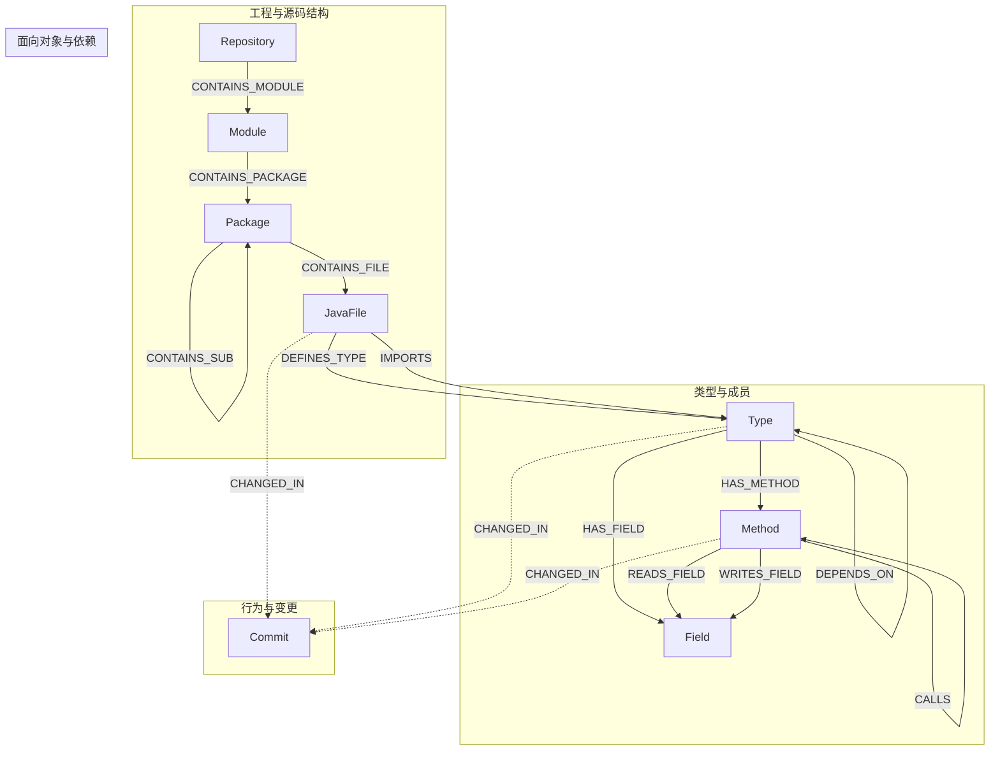

# 图谱数据结构设计

本文描述本项目中 **Neo4j 代码知识图谱** 的静态数据结构：节点标签（实体）、属性与业务主键、有向关系（边）及语义说明。范围与 `evaluation-types` 中的 `NodeType` / `RelationType`、`evaluation-domain` 中的图谱领域模型，以及 `evaluation-app/.../neo4j/constraints.cypher`、`Neo4jGraphAdapterImpl` 中的持久化字段保持一致。

**不在本文范围**：图谱的创建、增量更新、调度与写入顺序（见业务模块与 `技术方案.md`）。

---

## 1. 设计原则与约定

- **标签（Label）**：与 `NodeType` 枚举一一对应，写入 Neo4j 时使用 PascalCase，如 `REPOSITORY` → 标签 `Repository`。
- **业务主键**：各实体通过约定字段在库内唯一（并由 `constraints.cypher` 声明唯一约束，见第 3 节）。
- **有向边**：关系类型与 `RelationType` 枚举同名，在 Cypher 中为大写蛇形，如 `HAS_METHOD`。
- **跨仓隔离**：`Package`、`JavaFile`、`Commit` 等节点带有 `repoId` 属性，便于按仓库过滤；`Type` / `Method` / `Field` 的全局唯一性由各自业务键（全限定名、方法 id 等）保证，与仓库内源文件路径、所有者类型关联。
- **查询侧分组**：`GraphRelationGroup` 不是图中的实体，而是对 `RelationType` 子集的**逻辑分组**，用于子图展开、风险传播等场景的白名单配置（见第 5 节）。

---

## 2. 实体（节点）一览

下表为项目中定义的**全部图谱实体**，含 Neo4j 标签、业务含义、核心属性及唯一键说明。

| 标签（实体） | 枚举 `NodeType` | 含义 |
|--------------|-----------------|------|
| `Repository` | `REPOSITORY` | 一个已注册的 Git 代码仓库根。 |
| `Module` | `MODULE` | Maven 子模块（工程结构层）。 |
| `Package` | `PACKAGE` | Java 语言包（`package` 声明对应的逻辑命名空间）。 |
| `JavaFile` | `JAVA_FILE` | 单个 `.java` 源文件。 |
| `Type` | `TYPE` | Java 类型声明：类、接口、枚举或注解（由 `kind` 区分）。 |
| `Method` | `METHOD` | 方法或构造器（构造器在模型中 `isConstructor=true`）。 |
| `Field` | `FIELD` | 类型中的字段（含 `enum` 常量等字段声明）。 |
| `Commit` | `COMMIT` | 一次 Git 提交快照。 |

### 2.1 `Repository`（仓库）

| 属性 | 说明 |
|------|------|
| `id` | 业务主键，与 PostgreSQL 中仓库注册 id 对齐。 |
| `name` | 仓库显示名称。 |
| `url` | 克隆地址（如 HTTPS clone URL）。 |
| `defaultBranch` | 默认/索引所用分支名。 |
| `updatedAt` | 节点元数据更新时间（epoch 毫秒）。 |

**唯一约束**：`id`。

### 2.2 `Module`（Maven 模块）

| 属性 | 说明 |
|------|------|
| `id` | 业务主键，约定格式 `{repoId}:{artifactId}`。 |
| `name` | 模块名，通常与 `artifactId` 一致。 |
| `path` | 模块在仓库中的相对路径。 |
| `groupId` | Maven `groupId`。 |
| `artifactId` | Maven `artifactId`。 |
| `repoId` | 所属仓库 id。 |

**唯一约束**：`id`。

### 2.3 `Package`（包）

| 属性 | 说明 |
|------|------|
| `id` | 业务主键，约定 `{repoId}:{qualifiedName}`，避免多仓库同名包冲突。 |
| `qualifiedName` | 包全限定名，如 `com.example.service`；默认包可为空串。 |
| `path` | 包目录在文件系统上的绝对路径。 |
| `repoId` | 所属仓库 id。 |

**唯一约束**：`id`。

### 2.4 `JavaFile`（Java 源文件）

| 属性 | 说明 |
|------|------|
| `path` | 文件绝对路径，**作为业务主键**。 |
| `relativePath` | 相对仓库根的路径（当前模型中可为空串，视索引实现填充）。 |
| `checksum` | 内容校验（如 MD5），用于全量索引幂等判断。 |
| `lineCount` | 文件行数。 |
| `lastModified` | 最后修改时间（epoch 毫秒）。 |
| `repoId` | 所属仓库 id。 |

**唯一约束**：`path`。  
**二级索引**：`checksum`（见约束脚本）。

### 2.5 `Type`（类型：类 / 接口 / 枚举 / 注解）

| 属性 | 说明 |
|------|------|
| `qualifiedName` | 类型全限定名，**作为业务主键**。 |
| `simpleName` | 简单类名。 |
| `kind` | `TypeKind`：`CLASS`、`INTERFACE`、`ENUM`、`ANNOTATION`。 |
| `accessModifier` | 访问修饰符描述串（如 `public`）。 |
| `isAbstract` | 是否抽象（对接口、抽象类有意义）。 |
| `isFinal` | 是否 `final`。 |
| `isStatic` | 对内部类型表示是否 `static` 嵌套。 |
| `filePath` | 声明所在源文件绝对路径。 |
| `lineStart` / `lineEnd` | 声明在源文件中的行号范围。 |

**唯一约束**：`qualifiedName`。  
**二级索引**：`simpleName`、`filePath`。

### 2.6 `Method`（方法 / 构造器）

| 属性 | 说明 |
|------|------|
| `id` | 业务主键。普通方法：`{ownerQualifiedName}#{name}({参数类型简名},...)`；构造器：`{ownerQualifiedName}#<init>(...)`。 |
| `ownerQualifiedName` | 所属类型的全限定名。 |
| `simpleName` | 方法简名；构造器为 `<init>`。 |
| `signature` | 声明级完整签名（含修饰符、返回类型等，具体格式由解析器生成）。 |
| `returnType` | 返回类型展示串；构造器实现中可为 `void`。 |
| `accessModifier` | 访问修饰符。 |
| `isStatic` | 是否静态方法。 |
| `isAbstract` | 是否抽象方法。 |
| `isConstructor` | 是否构造器。 |
| `filePath` | 所在源文件绝对路径。 |
| `lineStart` / `lineEnd` | 声明行号范围。 |

**唯一约束**：`id`。  
**二级索引**：`simpleName`。

### 2.7 `Field`（字段）

| 属性 | 说明 |
|------|------|
| `id` | 业务主键，格式 `{ownerQualifiedName}#{fieldName}`。 |
| `ownerQualifiedName` | 所属类型全限定名。 |
| `simpleName` | 字段名。 |
| `typeName` | 字段类型在源码中的简名展示。 |
| `typeQualifiedName` | 字段类型解析得到的 JVM 全限定名；无法解析时可为空。 |
| `accessModifier` | 访问修饰符。 |
| `isStatic` | 是否静态字段。 |
| `isFinal` | 是否 `final`。 |
| `filePath` | 所在源文件绝对路径。 |
| `lineNo` | 字段声明行号。 |

**唯一约束**：`id`。

### 2.8 `Commit`（提交）

| 属性 | 说明 |
|------|------|
| `hash` | Git commit hash，**作为业务主键**。 |
| `message` | 提交说明。 |
| `author` | 作者显示名。 |
| `email` | 作者邮箱。 |
| `timestamp` | 提交时间戳（epoch 毫秒，具体语义由写入方填充）。 |
| `branch` | 关联分支名。 |
| `repoId` | 所属仓库 id。 |

**唯一约束**：`hash`。

---

## 3. Neo4j 约束与索引（与图谱实体直接相关）

以下在 `evaluation-app/src/main/resources/neo4j/constraints.cypher` 中定义，需在库中创建后保证与写入逻辑一致。

**唯一约束**：`Type.qualifiedName`，`Method.id`，`Field.id`，`JavaFile.path`，`Commit.hash`，`Repository.id`，`Module.id`，`Package.id`。

**非唯一索引**：`Type.simpleName`，`Method.simpleName`，`JavaFile.checksum`，`Type.filePath`。

---

## 4. 关系（边）一览

以下为项目中定义的**全部关系类型**（`RelationType`），均为**有向**关系。表中「端点键」指 Cypher `MATCH` 时用于定位端点的业务属性。

| 关系类型 | 起点标签 | 起点匹配键 | 终点标签 | 终点匹配键 | 边上属性 | 语义说明 |
|----------|----------|------------|----------|------------|----------|----------|
| `CONTAINS_MODULE` | `Repository` | `id` | `Module` | `id` | 无 | 仓库包含 Maven 子模块。 |
| `CONTAINS_PACKAGE` | `Module` | `id` | `Package` | `id` | 无 | 子模块包含顶层包（工程—包挂载）。 |
| `CONTAINS_SUB` | `Package` | `id` | `Package` | `id` | 无 | 父包包含子包（包层级树）。 |
| `CONTAINS_FILE` | `Package` | `id` | `JavaFile` | `path` | 无 | 包目录下包含某个 Java 源文件。 |
| `DEFINES_TYPE` | `JavaFile` | `path` | `Type` | `qualifiedName` | 无 | 源文件中声明了该类型（含顶层与嵌套类型的存储约定以写入为准）。 |
| `HAS_METHOD` | `Type` | `qualifiedName` | `Method` | `id` | 无 | 类型拥有方法或构造器。 |
| `HAS_FIELD` | `Type` | `qualifiedName` | `Field` | `id` | 无 | 类型拥有字段。 |
| `INNER_CLASS_OF` | `Type` | `qualifiedName` | `Type` | `qualifiedName` | 无 | 嵌套类型与外层类型的归属（内层 → 外层）。 |
| `EXTENDS` | `Type` | `qualifiedName` | `Type` | `qualifiedName` | 无 | 类继承父类。 |
| `IMPLEMENTS` | `Type` | `qualifiedName` | `Type` | `qualifiedName` | 无 | 类实现接口。 |
| `CALLS` | `Method` | `id` | `Method` | `id` | `lineNo`：整型，调用发生行号 | 编译期可解析的**方法间调用**（静态图，不涵盖反射等）。 |
| `READS_FIELD` | `Method` | `id` | `Field` | `id` | 无 | 方法读取某字段（字段级数据流/影响分析）。 |
| `WRITES_FIELD` | `Method` | `id` | `Field` | `id` | 无 | 方法写入某字段。 |
| `DEPENDS_ON` | `Type` | `qualifiedName` | `Type` | `qualifiedName` | 无 | 类型级依赖：如字段/参数/局部变量等引用的**非原始类型**在可解析时指向另一类型。 |
| `IMPORTS` | `JavaFile` | `path` | `Type` | `qualifiedName` | 无 | 源文件 `import` 语句解析到的被引用类型（不含星号、静态 import 的当前策略下不建边）。 |
| `CHANGED_IN` | `JavaFile` / `Type` / `Method`（设计意图） | 分别为 `path` / `qualifiedName` / `id` | `Commit` | `hash` | 无 | 某代码实体在指定提交中发生变更，用于提交维度的变更关联与种子解析。 |

**说明（`CHANGED_IN`）**：领域模型与适配器注释支持从文件、类型或方法连向 `Commit`；基础设施中批量写入模板需与起点标签一致。查询侧（如 AI 上下文组装的提交种子）会按 `Method`、`Type` 与 `Commit` 的组合进行检索。

---

## 5. 关系逻辑分组 `GraphRelationGroup`（非存储实体）

下列枚举值用于**配置多跳展开或分析时允许遍历的关系子集**，不对应 Neo4j 中的节点或边类型。

| 分组 | 包含的 `RelationType` | 用途简述 |
|------|------------------------|----------|
| `CALL_CHAIN` | `CALLS` | 方法调用链传播。 |
| `TYPE_HIERARCHY` | `EXTENDS`、`IMPLEMENTS` | 继承与实现结构。 |
| `FIELD_ACCESS` | `READS_FIELD`、`WRITES_FIELD` | 字段读写耦合。 |
| `TYPE_DEPENDS` | `DEPENDS_ON` | 类型间依赖。 |
| `IMPORTS` | `IMPORTS` | 文件级 import 依赖。 |
| `STRUCTURE` | `CONTAINS_MODULE`、`CONTAINS_PACKAGE`、`CONTAINS_SUB`、`CONTAINS_FILE`、`DEFINES_TYPE`、`HAS_METHOD`、`HAS_FIELD`、`INNER_CLASS_OF` | 仓库—模块—包—文件—类型—成员的整体结构边。 |

默认子图展开策略在 `GraphRelationGroup` 的 Javadoc 中约定：通常开启调用链、类型层次、字段访问、类型依赖；**默认关闭** `IMPORTS` 与 `STRUCTURE` 以降低子图规模爆炸风险。

---

## 6. 关系语义总图（Mermaid）

下列示意图表达**实体类型之间允许出现的关系类型**（不表示每条边在任意仓库中一定存在数据）。

图中虚线表示 `CHANGED_IN` 在设计上的可选起点（文件 / 类型 / 方法）。

---

## 7. 领域传输对象 `GraphRelation`（非 Neo4j 实体）

批量写入时，单条关系在 Java 侧用 `GraphRelation` 描述，字段包括：`fromNodeId`、`toNodeId`、`type`，以及用于文档与扩展的 `fromNodeLabel`、`fromKeyName`、`toNodeLabel`、`toKeyName`，和可选 `properties`（如 `CALLS` 的 `lineNo`）。该对象描述的是**待持久化的边**，不是图中的持久化节点类型。

---

## 8. 与外部 JSON 证据的对应（只读视角）

`ChangeEvidenceDocument` 等面向 LLM 的载荷中会引用与图谱一致的标识（如类型的 `qualifiedName`，方法/字段的 `id`），便于与 Neo4j 中实体对齐；其本身**不是**图谱中的节点类型，不纳入第 2 节实体表。

---

## 9. 文档与代码索引

| 说明 | 路径或类型 |
|------|------------|
| 节点类型枚举 | `evaluation-types/.../NodeType.java` |
| 关系类型枚举 | `evaluation-types/.../RelationType.java` |
| 关系分组枚举 | `evaluation-types/.../GraphRelationGroup.java` |
| 类型种类 | `evaluation-types/.../TypeKind.java` |
| 各节点 POJO | `evaluation-domain/.../codegraph/model/*Node.java` |
| 边描述 POJO | `evaluation-domain/.../codegraph/model/GraphRelation.java` |
| Neo4j 约束与索引 | `evaluation-app/src/main/resources/neo4j/constraints.cypher` |
| 标签与属性写入、关系 Cypher 模板 | `evaluation-infrastructure/.../Neo4jGraphAdapterImpl.java` |

---

*本文档随图谱模型枚举与 Neo4j 适配器变更而修订。*
