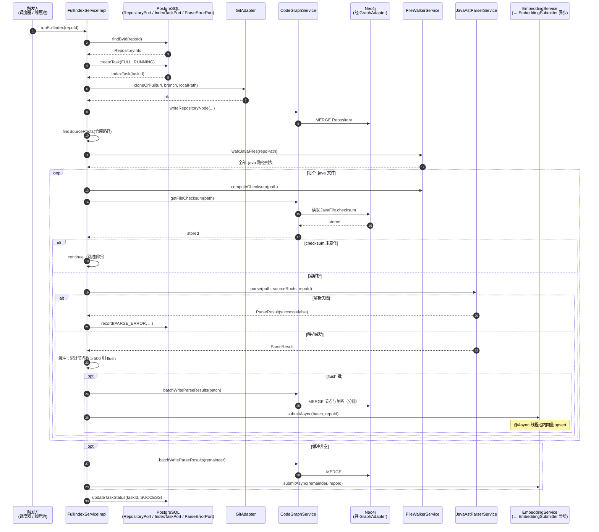
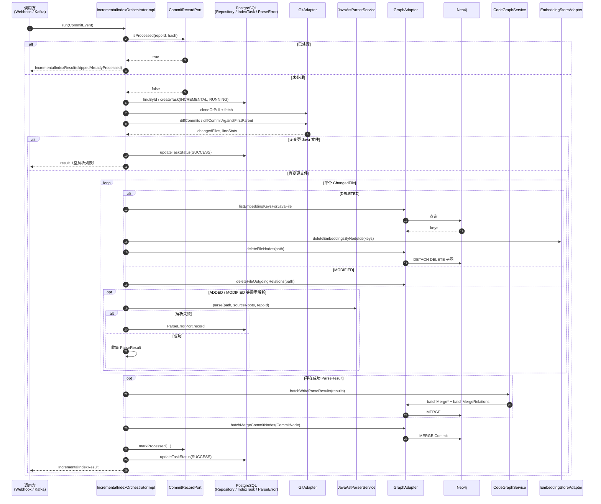
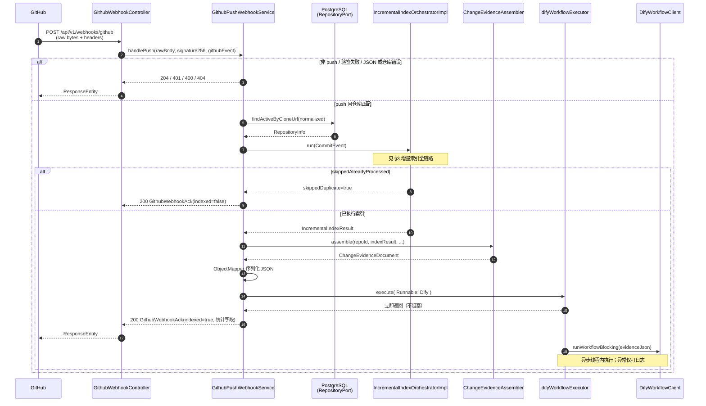
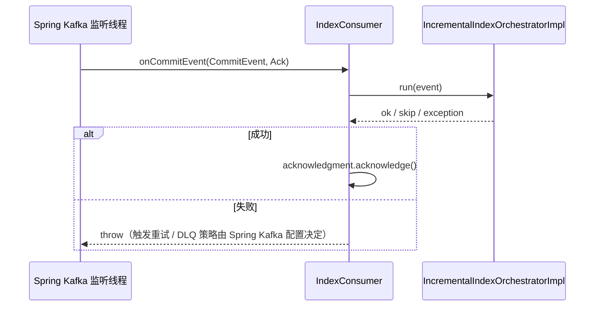

# 图谱构建

本文描述代码知识图谱在工程中的**构建与更新**路径，聚焦 **全量索引** 与 **增量索引** 的领域编排、与 Git / PostgreSQL / Neo4j / 向量库的交互，以及触发入口的差异。实现以 `evaluation-domain` 的索引与图谱服务为主，`evaluation-trigger` 提供 HTTP、调度与消息消费入口。

---

## 1. 触发方式总览

| 触发源 | 入口类 | 调用方式 | 索引类型 | 说明 |
|--------|--------|----------|----------|------|
| 手动 HTTP | `IndexController` | `indexTaskExecutor` 异步执行 `FullIndexService.runFullIndex` | 全量 | `POST /api/v1/index/trigger`，立即返回 `SUBMITTED`。 |
| 定时调度 | `IndexScheduler` | 调度线程**同步**逐个仓库调用 `runFullIndex` | 全量 | Cron 默认每天 02:00，可配置 `index.scheduler.cron`；单仓失败记录日志后继续下一仓。 |
| GitHub Webhook | `GithubWebhookController` → `GithubPushWebhookService` | Tomcat 线程**同步**执行增量编排 | 增量 | 仅 `X-GitHub-Event: push`；验签、对齐 `clone_url` 后执行。 |
| Kafka（可选） | `IndexConsumer` | 监听线程消费后**同步**调用 `IncrementalIndexOrchestrator.run` | 增量 | Topic 默认 `code-change-event`，与 Webhook 共用同一编排器。 |

**图谱写入的统一出口**：成功解析后的批量落库经 `CodeGraphService.batchWriteParseResults` → `GraphAdapter`（Neo4j 实现为 `Neo4jGraphAdapterImpl`）。全量路径在达到批阈值时还会调用 `EmbeddingService.submitAsync`（异步向量写入）；增量路径在**删除文件**时会清理向量，**新增/修改**当前编排器内**未**调用异步 Embedding 提交（与全量行为不一致，以代码为准）。

---

## 2. 全量索引：领域流程与时序

### 2.1 职责与数据流（文字）

`FullIndexServiceImpl.runFullIndex` 顺序概要：

1. **PostgreSQL**：`RepositoryPort` 按 `repoId` 取仓库；不存在则抛错。
2. **PostgreSQL**：`IndexTaskPort` 创建 `FULL` 任务，`RUNNING`。
3. **Git**：`GitAdapter.cloneOrPull` 更新本地工作副本。
4. **Neo4j**：`CodeGraphService.writeRepositoryNode` 写入/合并 `Repository` 节点。
5. **本地磁盘**：遍历仓库下所有 `**/src/main/java` 目录作为 `sourceRoots`；`FileWalkerService.walkJavaFiles` 收集全部 `.java` 路径。
6. **逐文件循环**：
   - 用 `FileWalkerService.computeChecksum` 与 `CodeGraphService.getFileChecksum`（读 Neo4j 中已有 `JavaFile.checksum`）比较，相同则**跳过解析**（幂等）。
   - `JavaAstParserService.parse` 生成 `ParseResult`；失败则 `ParseErrorPort.record` 并跳过该文件。
   - 将多个文件的解析结果放入内存缓冲；当缓冲内「类型+方法+字段」节点数累计 ≥ 500 时：
     - `CodeGraphService.batchWriteParseResults` → Neo4j（先 Package / JavaFile / Type / Method / Field 节点，再分批关系）。
     - `EmbeddingService.submitAsync` → `@Async("embeddingExecutor")` 的 `EmbeddingSubmitter` 对 `Type`/`Method` 调用 `EmbeddingStoreAdapter.upsertEmbedding`。
7. 循环结束后 **flush** 剩余缓冲（再次写 Neo4j + 提交异步 Embedding）。
8. **PostgreSQL**：任务状态更新为 `SUCCESS`；异常则 `FAIL` 并抛出 `IndexTaskException`。

### 2.2 时序图（核心参与方）

下列时序图省略「逐文件循环」内部的反复消息，用 **loop** 表示；Neo4j 与 PG 分别抽象为存储参与方。

### 2.3 手动触发与定时触发的差异

- **手动**（`IndexController`）：HTTP 线程只把 `runFullIndex` 提交到 `indexTaskExecutor`，**立即**返回；实际全量在后台线程执行，时序图触发方写为「线程池中的任务」即可。
- **定时**（`IndexScheduler`）：`@Scheduled` 方法内**顺序**对每个 ACTIVE 仓库调用 `runFullIndex`，与上图一致但无单独线程池包裹单次调用。

---

## 3. 增量索引：领域流程与时序

### 3.1 职责与数据流（文字）

`IncrementalIndexOrchestratorImpl.run(CommitEvent)` 顺序概要：

1. **幂等**：`CommitRecordPort.isProcessed(repoId, commitHash)` 为真则直接返回 `skippedAlreadyProcessed=true`，**不写图**、不更新任务表（与 Webhook 中跳过 Dify 的分支一致）。
2. **PostgreSQL**：校验仓库存在；`IndexTaskPort` 创建 `INCREMENTAL` 任务 `RUNNING`。
3. **Git**：`cloneOrPull` 后 `fetch`，保证能对比到父提交。
4. **Diff**：若 `parentCommitHash` 为 GitHub 全 0 空 SHA 等「空父」情形，则用 `diffCommitAgainstFirstParent`；否则 `diffCommits(parent, after)`，得到变更 Java 文件列表；并计算 `diffLineStats` 供统计与下游证据。
5. 若无变更 Java 文件：任务置 `SUCCESS` 并返回（**不**写入 `Commit` 节点）。
6. **逐变更文件** `processChangedFiles`：
   - **DELETED**：列出该文件下图谱节点的向量键 → `EmbeddingStoreAdapter.deleteEmbeddingsByNodeIds` → `GraphAdapter.deleteFileNodes`（级联删 Method/Field/Type/JavaFile）。
   - **MODIFIED**：`GraphAdapter.deleteFileOutgoingRelations` 清除该文件相关出边，再全量重解析该文件并 MERGE 回图。
   - **ADDED** 等其余类型：直接解析并稍后批量写入。
   - 解析失败：`ParseErrorPort.record`，该文件不进入成功结果集。
7. 若存在任一成功解析结果：`CodeGraphService.batchWriteParseResults` 一次性写入本批 `ParseResult`（增量按变更文件集合，通常单批即可）。
8. **Neo4j**：`GraphAdapter.batchMergeCommitNodes` 写入本次 `Commit` 节点（**当前实现未**随此步骤写入 `CHANGED_IN` 边，仅以 `Commit` 元数据落库；查询侧若依赖 `CHANGED_IN` 需与实现演进对齐）。
9. **PostgreSQL**：`CommitRecordPort.markProcessed`；`IndexTaskPort` 更新 `SUCCESS`。异常则任务 `FAIL` 并抛 `IndexTaskException`。

### 3.2 时序图（单文件分支合并描述）

---

## 4. GitHub Push Webhook：HTTP 与图谱及下游的时序

Webhook 在**同一次 HTTP 请求**内完成：验签、仓库对齐、**增量图谱**、`ChangeEvidenceAssembler`；**Dify 工作流**在 `difyWorkflowExecutor` 中异步执行，响应不等待其结束。

---

## 5. Kafka 增量消费（简图）

与 §3 共用 `IncrementalIndexOrchestrator.run`；消费成功后才 `Acknowledgment.acknowledge()`。

---

## 6. 与《图谱数据结构设计》的衔接

- 全量/增量最终都通过 `CodeGraphService` 将 `ParseResult` 中的节点与 `GraphRelation` 批量 MERGE 到 Neo4j，**实体与关系类型**见根目录 `图谱数据结构设计.md`。
- 全量额外通过 `EmbeddingService` 将本批中的 `Type`/`Method` 异步写入向量存储；增量仅在**文件删除**路径删除对应向量。

---

## 7. 源码索引

| 主题 | 路径 |
|------|------|
| 全量索引实现 | `evaluation-domain/.../FullIndexServiceImpl.java` |
| 增量编排实现 | `evaluation-domain/.../IncrementalIndexOrchestratorImpl.java` |
| 图谱批量写入 | `evaluation-domain/.../CodeGraphServiceImpl.java` |
| 异步向量提交 | `evaluation-domain/.../EmbeddingSubmitter.java` |
| Webhook | `evaluation-trigger/.../GithubWebhookController.java`、`GithubPushWebhookService.java` |
| 手动触发 | `evaluation-trigger/.../IndexController.java` |
| 定时全量 | `evaluation-trigger/.../IndexScheduler.java` |
| Kafka 增量 | `evaluation-trigger/.../IndexConsumer.java` |

---

*文档与仓库实现一致；若编排器或 Webhook 行为变更，请同步修订本节时序。*
