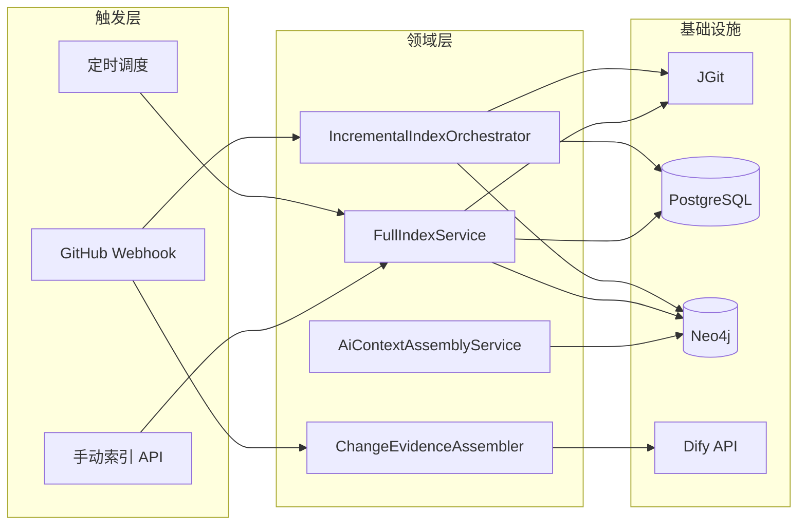

# AI 代码变更评估 — 技术方案（详细）

## 1. 项目定位与目标

本仓库 **ai-code-change-evaluation** 面向 **Java 代码仓库的变更**，提供一条可落地的工程链路：

1. **离线索引**：用 **JGit** 拉取代码，用 **JavaParser** 解析 AST，将结构关系写入 **Neo4j** 知识图谱。
2. **元数据与任务**：用 **PostgreSQL** 记录仓库注册、全量/增量索引任务、已处理提交（幂等）、解析失败等。
3. **变更触发**：支持 **GitHub `push` Webhook** 同步执行增量索引与 **变更证据（ChangeEvidence）** 组装；可选将证据 JSON **异步**投递 **Dify 工作流**。
4. **分析与检索**：提供 **影响面分析**、**全文代码检索**、**风险种子在图上的有界传播**、**面向 LLM 的上下文拼装（AiContext）** 等 HTTP 能力。

> 说明：仓库内另有 `docs/` 下的设计类文档（如知识图谱规划），与当前 Maven 模块命名可能不完全一致；**以代码与 `pom.xml` 为准**。

---

## 2. 架构总览

### 2.1 逻辑分层（Maven 多模块）

| 模块 | 职责 |
|------|------|
| **evaluation-types** | 错误码、枚举、文件变更类型、图关系分组等跨模块共享定义 |
| **evaluation-api** | HTTP 契约：`@RequestMapping` 定义在接口上，Controller 在 trigger 中实现 |
| **evaluation-domain** | 领域服务、编排器、端口（`adapter` 接口）、领域模型；**不**直接访问 DB |
| **evaluation-infrastructure** | 端口实现：Neo4j、PostgreSQL/MyBatis、JGit、邮件等 |
| **evaluation-trigger** | Controller、Webhook、全局异常处理、调度器实现类 |
| **evaluation-app** | Spring Boot 启动类、`application.yml`、MyBatis XML、`db/init.sql`、`neo4j/constraints.cypher`、线程池等 `@Configuration` |

启动类：`com.sigma.ai.evaluation.app.EvaluationApplication`，扫描 `com.sigma.ai.evaluation`，`@MapperScan` 指向 `infrastructure.pg.mapper`。

### 2.2 端到端数据流（简化）

---

## 3. 仓库与包结构

### 3.1 顶层目录

| 路径 | 说明 |
|------|------|
| `pom.xml` | 父 POM：`dependencyManagement`、子模块、JDK/Spring/驱动等版本属性 |
| `evaluation-*` | 上述六个 Java 子模块 |
| `docker-compose.yml` | 本地中间件编排（含 PostgreSQL、Neo4j 等；完整服务列表以文件为准） |
| `scripts/` | 与 **Dify 工作流节点** 配套的 Python：提示词模板、载荷解析、风险节点筛选、邮件 HTML 合并等 |
| `.cursor/rules/` | Java 分层、Javadoc、SLF4J 日志等协作规范 |

### 3.2 领域子包（`evaluation-domain` 下 `...domain`）

| 包路径（后缀） | 典型职责 |
|----------------|----------|
| `index` | 全量/增量索引、`CommitEvent`、`IncrementalIndexOrchestrator`、AST 解析服务、文件遍历 |
| `codegraph` | 图谱节点模型、`CodeGraphService`、`GraphAdapter`（由 infrastructure 实现 Cypher） |
| `impact` | 影响面查询模型与 `ImpactAnalysisService` |
| `codesearch` / `codesnippet` | 文本检索、按路径/行号读片段 |
| `changeevidence` | `ChangeEvidenceDocument`、`ChangeEvidenceAssembler`、diff 相关性抽取 |
| `riskpropagation` | 风险种子在图上的有界传播策略与 `RiskPropagationService` |
| `aicontext` | 基于图展开等的 LLM 分析上下文拼装 |
| `repository` | 仓库信息、Git diff 等端口与模型 |

---

## 4. 核心技术栈与版本

### 4.1 构建与语言

- **JDK 17**（`maven.compiler.source/target`）
- **Maven**：父工程聚合子模块；**maven-compiler-plugin** 配置 Lombok + MapStruct 注解处理器路径

### 4.2 Java 依赖（摘自父 `pom.xml` 属性，以实际文件为准）

| 类别 | 组件 | 版本（属性） |
|------|------|----------------|
| 框架 | Spring Boot | 3.2.5 |
| 图数据库 | neo4j-java-driver | 5.18.0 |
| ORM | mybatis-spring-boot-starter | 3.0.3 |
| JDBC | postgresql | 42.7.3 |
| AST | javaparser-symbol-solver-core | 3.25.10 |
| Git | org.eclipse.jgit | 6.9.0 |
| 工具 | lombok、mapstruct、guava、commons-lang3、jackson | 见父 POM |

父 POM 中另管理有其他依赖版本（如消息、向量、gRPC 等），若仅关注本文所述能力，以 **Neo4j + PostgreSQL + Spring Web** 为主线即可。

### 4.3 中间件镜像（与本地编排相关）

| 服务 | 镜像/说明 | 用途 |
|------|-----------|------|
| postgres | postgres:15-alpine | 元数据与任务；挂载 `evaluation-app/.../db/init.sql` 初始化 |
| neo4j | neo4j:5.15-community | 代码图谱 |

`docker-compose.yml` 中还可包含其他容器，**不在本文展开**。

### 4.4 测试

- **JUnit 5**、**Mockito**、**Spring Boot Test**；**Testcontainers** BOM 已管理，集成测试可按需引入

---

## 5. 数据模型

### 5.1 PostgreSQL（`db/init.sql`）

| 表名 | 用途 |
|------|------|
| **t_repository** | 仓库注册：`id`、`name`、`clone_url`、`branch`、`local_path`、`status`（ACTIVE/INACTIVE） |
| **t_index_task** | 索引任务流水：`task_type`（FULL/INCREMENTAL）、`trigger_commit`、`status`、时间戳与错误信息 |
| **t_commit_record** | 已处理提交：`(repo_id, commit_hash)` 唯一，用于 **增量幂等** |
| **t_parse_error** | 单文件解析失败记录，关联 `task_id` |

Webhook 通过 **规范化后的 clone_url** 与 `t_repository` 对齐；未命中则返回 **404**。

### 5.2 Neo4j

- **节点标签**（与代码模型及 `constraints.cypher` 一致）：`Repository`、`Module`、`Package`、`JavaFile`、`Type`、`Method`、`Field`、`Commit` 等。
- **约束与索引**（`evaluation-app/src/main/resources/neo4j/constraints.cypher`）：
  - 唯一：`Type.qualifiedName`、`Method.id`、`Field.id`、`JavaFile.path`、`Commit.hash`、`Repository.id`、`Module.id`、`Package.id` 等。
  - 二级索引：`Type.simpleName`、`Method.simpleName`、`JavaFile.checksum`、`Type.filePath` 等。
- **执行方式**：注释写明需在应用首次写入前 **在 Neo4j 中手动执行**该脚本（非 Spring 自动跑）。

---

## 6. 核心业务流程

### 6.1 GitHub `push` Webhook（同步索引 + 异步 Dify）

- **路径**：`POST /api/v1/webhooks/github`，`Content-Type: application/json`，body 为 GitHub 原始 JSON 的 **字节形式**（用于验签）。
- **请求头**：`X-GitHub-Event`（仅 `push` 处理）、`X-Hub-Signature-256`（配置 `github.webhook.secret` 时必填且校验 **HMAC-SHA256**；未配置则打 WARN 并跳过验签，**仅适合本地**）。
- **处理步骤**（`GithubPushWebhookService`）：
  1. 非 `push` → **204 No Content**。
  2. 解析 `repository.clone_url` / `ssh_url`，在 PG 中查找 **ACTIVE** 仓库；找不到 → **404**。
  3. 读取 `before` / `after` / `ref` / commits 等，构造 `CommitEvent`。
  4. 调用 **`IncrementalIndexOrchestrator.run`**：更新 Neo4j 图谱、提交记录等；若提交已处理 → 返回 `skippedDuplicate=true`，**不写 Dify**。
  5. **`ChangeEvidenceAssembler`** 生成 `ChangeEvidenceDocument`（含 meta、变更文件、节点与 diff 片段、截断信息等）。
  6. 将证据序列化为 JSON 字符串，提交到 **`difyWorkflowExecutor` 线程池**，在后台调用 **`DifyWorkflowClient.runWorkflowBlocking`**；HTTP **立即**返回 `GithubWebhookAck`（含变更 Java 文件数、证据节点数、增删行统计等）。
- **Dify HTTP**：`POST {base-url}/v1/workflows/{workflow-id}/run`，`response_mode=blocking`，`inputs` 中键名由 `dify.workflow.input-key` 指定（默认整包 JSON 字符串）。

### 6.2 定时全量索引

- **`IndexScheduler`**（实现 `IndexSchedulerApi`）：按 `index.scheduler.cron`（默认每天 **02:00**）遍历所有 ACTIVE 仓库，逐个调用 **`FullIndexService.runFullIndex`**；单仓失败记录日志并继续下一仓。

### 6.3 手动触发全量索引

- **`IndexController`** 实现 `IndexTriggerApi`：`POST /api/v1/index/trigger`，校验 `repoId` 后丢入 **`indexTaskExecutor`** 异步执行 `runFullIndex`，立即返回 `SUBMITTED`。

### 6.4 影响面分析

- **`ImpactAnalysisService`**：基于 Neo4j Cypher 做多跳调用链、子类型等分析；HTTP 层对 `maxHops` 做上限（与 `ImpactController` 实现一致，例如不超过 5）。

### 6.5 AI 分析上下文拼装

- **`AiContextAssemblyServiceImpl`**：按请求组合 **图展开**、可选 **提交范围解析**、**摘要** 等；受 `ai.context.*` 限制（节点/边/路径硬上限、组装超时等），并在输出中带 **能力边界说明**（例如静态图不承诺覆盖 HTTP 入口全链路）。

### 6.6 风险传播

- **`RiskPropagationServiceImpl`**：委托 `GraphAdapter.propagateRisks`，在 Neo4j 上做 **有界深度/规模** 的遍历；深度由 `RiskPropagationDepthPolicy` 规范化。

---

## 7. HTTP API 一览

契约定义在 **`evaluation-api`** 的 `*Api` 接口上，前缀多为 **`/api/v1`**（Webhook 例外）。

| 方法 | 路径 | 说明 |
|------|------|------|
| POST | `/api/v1/webhooks/github` | GitHub Webhook（见 §6.1） |
| POST | `/api/v1/index/trigger` | 手动触发全量索引（异步） |
| POST | `/api/v1/impact/analyze` | 影响面分析 |
| POST | `/api/v1/code/text-search` | 代码全文检索 |
| POST | `/api/v1/code/snippet` | 读取指定文件片段 |
| POST | `/api/v1/risk/propagation` | 风险种子图传播 |
| POST | `/api/v1/ai/analysis-context` | 组装 LLM 用结构化上下文 |
| POST | `/api/v1/mail/html` | 发送 HTML 邮件（需配置 `spring.mail.*` 且基础设施启用邮件 Bean） |

另有 **`GlobalExceptionHandler`** 统一异常响应格式。

---

## 8. 异步与线程池

配置类：**`evaluation-app`** 下的 `ThreadPoolConfig`（示例 Bean 名）：

- **`indexTaskExecutor`**：手动全量索引等后台任务。
- **`difyWorkflowExecutor`**：Webhook 后 Dify **blocking** 调用，避免占用 Tomcat 线程。

---

## 9. `scripts/` Python 脚本（与 Dify 编排配套）

这些脚本通常用于 **在 Dify 中粘贴为 Code 节点** 或本地调试，与 Java 主工程解耦；依赖需按脚本自行安装。

| 脚本 | 作用概要 |
|------|----------|
| `dify_parse_change_payload.py` | 解析变更载荷 JSON，供后续节点使用 |
| `dify_risk_nodes_filter_and_depth.py` | 风险相关节点筛选与深度处理 |
| `dify_risk_prompt_builder.py` | 风险初步评估 Prompt 模板 |
| `dify_risk_identification_prompt_builder.py` | 风险识别类 Prompt |
| `dify_developer_report_prompt_builder.py` | 开发者报告 Prompt |
| `dify_summary_prompt_builder.py` | 摘要类 Prompt |
| `dify_mail_html_body_merge.py` | 邮件 HTML 正文合并 |
| `post_risk_propagation.py` / `parse_risk_propagation_response.py` | 与风险传播 API/响应解析相关 |
| `send_html_mail.py` | SMTP 发送 HTML 邮件（独立脚本） |
| `test_dify_risk_nodes_filter_and_depth.py` | 针对筛选逻辑的单测风格脚本 |

---

## 10. 配置说明（不含敏感值）

主要文件：**`evaluation-app/src/main/resources/application.yml`**。

| 前缀 | 含义 |
|------|------|
| `server.port` | HTTP 端口（默认 18080） |
| `spring.datasource.*` | PostgreSQL |
| `spring.neo4j.*` | Neo4j Bolt 认证 |
| `mybatis.*` | Mapper XML 路径与运行时设置 |
| `github.webhook.secret` | Webhook 验签密钥；空则跳过 |
| `dify.workflow.*` | 是否启用、base-url、workflow-id、api-key、user、input-key、snippet 限制、HTTP 超时 |
| `ai.context.*` | 上下文拼装上限与超时 |
| `thread-pool.*` | 各线程池大小与队列 |
| `index.scheduler.cron` | 全量调度 Cron |
| `spring.mail.*` | SMTP（可选） |

**安全**：切勿将 **SMTP 密码、Dify API Key、GitHub Secret** 提交到 Git；生产环境请用环境变量或密钥管理系统注入。

---

## 11. 本地开发与运行顺序建议

1. 按需启动 **PostgreSQL、Neo4j**（可使用 `docker compose up -d`，具体服务以 `docker-compose.yml` 为准）。
2. 在 Neo4j 执行 **`neo4j/constraints.cypher`**。
3. 确保 `t_repository` 中已有目标仓库且 `clone_url` 与 GitHub 一致、`local_path` 可写。
4. `mvn -pl evaluation-app -am spring-boot:run` 或使用 IDE 运行 `EvaluationApplication`。
5. GitHub 仓库 Webhook 指向 `http(s)://<host>:<port>/api/v1/webhooks/github`，Content type 选 **application/json**，Secret 与配置一致。

常用构建：`mvn verify` 全量编译与测试。

---

## 12. 与设计文档的关系

`docs/` 下部分 Markdown 描述过更理想的模块拆分（如独立 `api-gateway`、Flyway、gRPC `.proto` 等）。**当前已实现形态**以本文 §2～§7 为准；若后续演进，建议同步更新本节以免读者混淆。

---

*文档版本：与仓库代码联动的说明性文档；修订时请同步关键配置项与 API 路径。*
